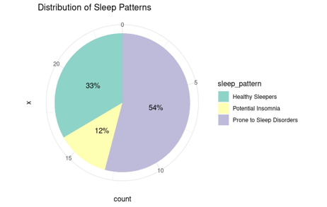
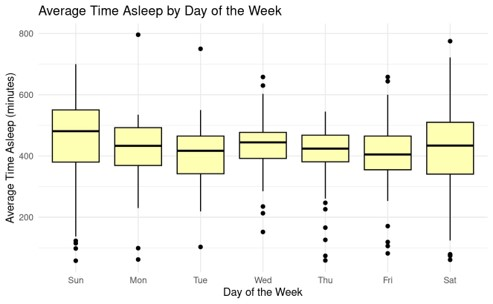
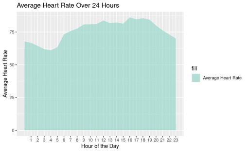

# Bellabeat Analysis Report

## How Can a Wellness Technology Company Play It Smart?
**Date:** May 28, 2024  
**Author:** Lai Jien Weng  
**Contact Information:**  
**Email:** reallyhat@gmail.com  
**Phone:** +60 16-385 9710

## Overview

Bellabeat, a high-tech manufacturer of products for women, is a successful small company with the potential to become a global player in the smart device market. Urška Sršen, co-founder and Chief Creative Officer of Bellabeat, believes that analyzing smart device fitness data could help unlock new growth opportunities for the company. This report aims to derive insights on how consumers are using their smart devices by analyzing available data from Bellabeat.

## Problem Statements
1. What are the sleeping patterns of FitBit users?
2. How is the quality of FitBit users' sleep distributed?
3. How is FitBit users' heart rate distributed?

## Goals
1. Increase Bellabeat’s sales by analyzing available data to discover trends and insights for targeted marketing strategies.
2. Explore growth opportunities by identifying high-demand markets for potential expansion.

## Dataset
- **FitBit Fitness Tracker Data**: This dataset, available on [Kaggle](https://www.kaggle.com/datasets/arashnic/fitbit), contains personal fitness tracker data from thirty FitBit users, including minute-level output for physical activity, heart rate, and sleep monitoring. The data was generated via Amazon Mechanical Turk between March 12, 2016, and May 12, 2016.

## Data Preparation
1. **Cleaning the Data**: 
   - Checked for missing values and duplicates.
   - Removed inconsistencies and ensured proper formatting for analysis.

2. **Formatting**:
   - Standardized the dataset to facilitate analysis.
   - Ensured all data points were correctly labeled and categorized.

## Analysis and Insights

### Sleep Pattern Distribution

We classified sleep patterns into three categories using the Multiple Sleep Latency Test (MSLT) results:
- **Healthy Sleepers (33%)**: Fall asleep in less than 20 minutes.
- **Prone to Sleep Disorders (54%)**: Take 20 to 50 minutes to fall asleep during at least one nap.
- **Potential Insomnia (13%)**: Consistently take more than 50 minutes to fall asleep.

**Insights**: 
- The majority of users are prone to sleep disorders, indicating a significant market for sleep improvement solutions. Bellabeat could develop products focused on enhancing sleep quality, such as sleep trackers with guided meditation features.

### Average Time Asleep

- **Weekends (Saturday & Sunday)**:
  - Higher median sleep duration with greater variability (broader interquartile range).
- **Weekdays (Monday to Friday)**:
  - Lower and more consistent median sleep duration.

**Insights**:
- Weekend sleep duration fluctuation is likely due to reduced obligations and compensation for weekday sleep deficits. Bellabeat can introduce educational content on maintaining consistent sleep schedules and the health impacts of sleep.

### Average Time to Fall Asleep

- **Sunday (50 minutes)**: Highest average time to fall asleep, suggesting anxiety about the upcoming week.
- **Monday to Saturday (35-40 minutes)**: Stable time to fall asleep during the workweek.

**Insights**:
- Users may experience anxiety on Sundays. Bellabeat could introduce features like a guided wind-down routine specifically designed for Sunday nights to help users reduce anxiety and improve sleep onset.

### Heart Rate Analysis

- **Midnight**: Low average heart rate indicating restful sleep and high parasympathetic activity.
- **3:30 pm - 7:00 pm**: High average heart rate due to physical activities or exercise.

**Anomaly Detection**: 
- Unusually high heart rates during sleep or sudden spikes can indicate stress or medical conditions. Bellabeat could implement continuous heart rate monitoring and trigger alerts for abnormalities, with options to contact emergency services if necessary.

## Key Findings and Actionable Insights

### Sleep Patterns
- **Healthy Sleepers (33%)**: Maintain good sleep habits.
- **Prone to Sleep Disorders (54%)**: Require personalized recommendations and tools for sleep improvement.
- **Potential Insomnia (13%)**: Suggest professional consultations and advanced sleep tracking features.

**Actionable Insights**:
- Provide tailored content and recommendations to each user group.
- Develop a service offering personalized consultations based on user sleep data.

### Time Asleep
- **Key Findings**: Inconsistent sleep duration with higher variability on weekends.

**Actionable Insights**:
- Introduce aromatic devices and promote sleep education content to improve sleep quality and consistency.

### Time to Fall Asleep
- **Key Findings**: Longer time to fall asleep on Sundays due to anxiety.

**Actionable Insights**:
- Integrate guided meditation sessions into Bellabeat devices to help users relax and fall asleep faster, especially on Sundays.

### Heart Rate
- **Key Findings**: Lowest heart rates at midnight and highest in the afternoon/evening.

**Actionable Insights**:
- Develop features to monitor heart rate continuously and alert users to anomalies.
- Encourage consistent physical activity through personalized exercise plans.

## Conclusion
By leveraging these insights, Bellabeat can enhance their product offerings, improve user health and wellness, and establish a stronger presence in the smart device market. To see the detailed process behind the analysis, please refer to `Bellabeat.html`, which is generated from `Bellabeat.RMD`. Please download the dataset from [Kaggle](https://www.kaggle.com/datasets/arashnic/fitbit).

## Data Source
- [FitBit Fitness Tracker Data on Kaggle](https://www.kaggle.com/datasets/arashnic/fitbit)
  
